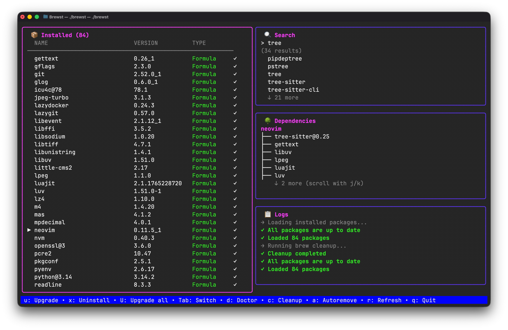

# Brewst 🍺

A beautiful and intuitive TUI (Terminal User Interface) application for managing Homebrew packages and casks on macOS.


## 📸 Screenshots

### Main Dashboard



## ✨ Features

### Core Package Management
- ✅ View all installed formulae and casks in a unified list
- ✅ Real-time search across Homebrew repository
- ✅ Install/uninstall packages with confirmation dialogs
- ✅ Upgrade individual or all outdated packages
- ✅ Detailed package information (version, dependencies, description)
- ✅ Visual indicators for outdated packages (⚠)
- ✅ Dependency tree visualization

### System Utilities
- ✅ Run `brew doctor` to diagnose issues
- ✅ Clean up old versions with `brew cleanup`
- ✅ Remove unused dependencies with `brew autoremove`
- ✅ Real-time operation logs with color coding

### UI/UX
- ✅ Split-panel layout for efficient workflow
- ✅ Keyboard-driven navigation (vim-style)
- ✅ Color-coded status (✓ installed, ⚠ outdated)
- ✅ Live search with instant results
- ✅ Scrollable dependency trees
- ✅ Operation logs with success/error highlighting

## Tech Stack

- **Language**: Go
- **TUI Framework**: [Bubble Tea](https://github.com/charmbracelet/bubbletea)
- **UI Components**: [Bubbles](https://github.com/charmbracelet/bubbles)
- **Styling**: [Lip Gloss](https://github.com/charmbracelet/lipgloss)

## 📦 Installation

### From Source
Requires Go 1.21 or later:

```bash
go install github.com/lazar0169/brewst@latest
```

Make sure `$(go env GOPATH)/bin` is in your PATH. Add this to your `~/.zshrc` or `~/.bash_profile`:

```bash
export PATH="$PATH:$(go env GOPATH)/bin"
```

Then reload your shell with `source ~/.zshrc` and run `brewst`.

### Pre-built Binaries
Download the latest release from [GitHub Releases](https://github.com/lazar0169/brewst/releases).

### Build from Source
```bash
git clone https://github.com/lazar0169/brewst.git
cd brewst
go build -o brewst
./brewst
```

## 🚀 Usage

Simply run:
```bash
brewst
```

### Layout

The interface is divided into 4 panels:

```
┌─────────────────────┬─────────────────────┐
│                     │   🔍 Search         │
│   📦 Installed      │                     │
│                     ├─────────────────────┤
│   (50%)             │   🌳 Dependencies   │
│                     │                     │
│                     ├─────────────────────┤
│                     │   📋 Logs           │
└─────────────────────┴─────────────────────┘
```

### ⌨️ Keyboard Shortcuts

#### Global
- `q` or `Ctrl+C` - Quit application
- `Tab` - Cycle through panels (Installed → Search → Dependencies)
- `r` - Refresh package list

#### Navigation
- `j` or `↓` - Move down
- `k` or `↑` - Move up

#### Package Management (Installed Panel)
- `u` - Upgrade selected outdated package
- `U` - Upgrade all outdated packages
- `x` - Uninstall selected package

#### Search Panel
- Type to enter search mode
- `Enter` - Execute search / Install selected package
- `Esc` - Exit search input
- `j/k` - Navigate search results

#### Utilities
- `d` - Run `brew doctor`
- `c` - Run `brew cleanup`
- `a` - Run `brew autoremove`

### Configuration

Configuration is stored in `~/.config/brewst/config.json`. The file is created automatically on first run with default settings.

### Favorites

Favorite packages are saved to `~/.config/brewst/favorites.json` and persist across sessions.

## 🛠️ Development

### Prerequisites
- Go 1.21 or later
- macOS with Homebrew installed
- Git

### Setup
```bash
# Clone the repository
git clone https://github.com/lazar0169/brewst.git
cd brewst

# Install dependencies
go mod download

# Run the application
go run .

# Build
go build -o brewst

# Run tests
go test ./...
```

### Building for Release

```bash
# Build for macOS (Intel)
GOOS=darwin GOARCH=amd64 go build -o brewst-darwin-amd64

# Build for macOS (Apple Silicon)
GOOS=darwin GOARCH=arm64 go build -o brewst-darwin-arm64
```

### Project Structure
```
brewst/
├── main.go              # Entry point
├── internal/
│   ├── app/            # Main application model
│   ├── brew/           # Homebrew client & parsers
│   ├── state/          # Application state management
│   └── ui/
│       ├── components/ # Reusable UI components
│       ├── styles/     # Lipgloss styling
│       └── views/      # Dashboard view
└── go.mod
```

## 🤝 Contributing

Contributions are welcome! Please feel free to submit a Pull Request. For major changes, please open an issue first to discuss what you would like to change.

## 📝 License

MIT - See [LICENSE](LICENSE) file for details

## 🙏 Acknowledgments

- Built with the amazing [Charm](https://charm.sh/) libraries
- Inspired by the need for a better Homebrew management experience

## ⚠️ Requirements

- **macOS**: Homebrew is macOS-specific
- **Homebrew**: Must be installed ([installation guide](https://brew.sh))
- **Terminal**: Color support recommended for best experience
